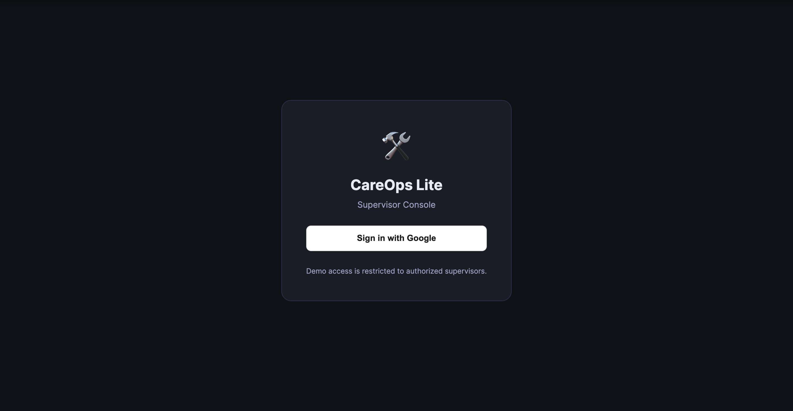
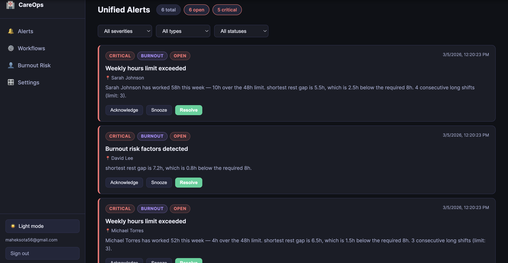
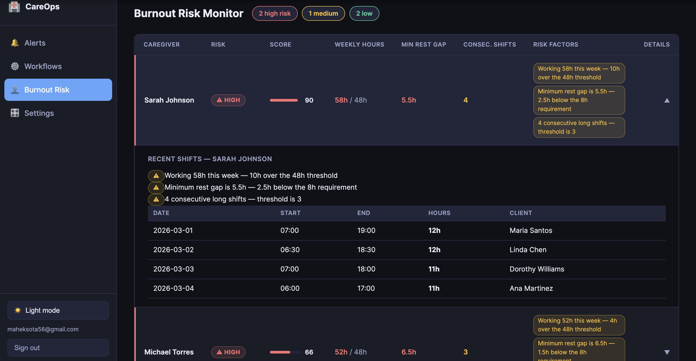
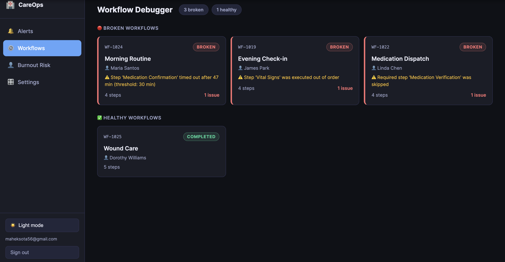
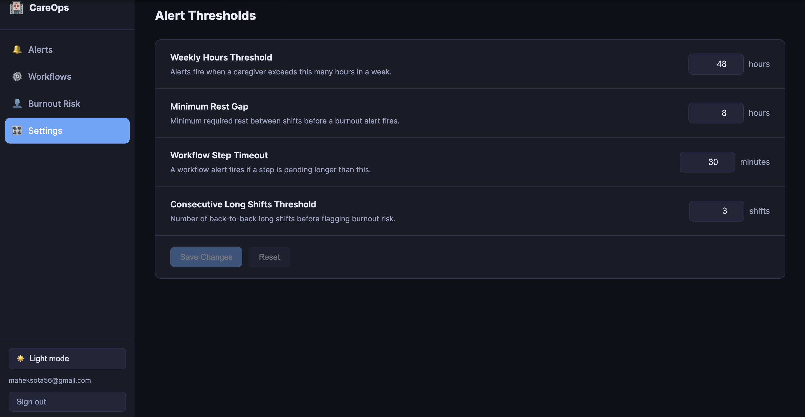

# 🏥 CareOps Lite

> A supervisor console for home care operations — real-time burnout risk monitoring, workflow debugging, and configurable alert thresholds.


---

## Overview

CareOps Lite gives supervisors a single place to monitor caregiver burnout risk and workflow health across their team. Everything — alert text, risk scores, workflow statuses — is computed dynamically from the current threshold settings, so changing a threshold immediately reflects across the whole app with no stale data.

**Key features:**

- **Unified Alerts** — all burnout and workflow alerts in one feed, filterable by severity, type, and status
- **Workflow Debugger** — step-by-step timeline for each workflow instance showing timeouts, skipped steps, and out-of-order execution
- **Burnout Risk Monitor** — ranked caregiver table with live risk scores, expandable shift history, and threshold-aware reason tags
- **Configurable Thresholds** — change weekly hours limit, rest gap, workflow timeout, and consecutive shift limits; everything updates immediately
- **Google OAuth SSO** — email allowlist-based access control
- **Dark / Light mode** — persisted to localStorage, WCAG AA accessible colour palette
- **Fully responsive** — collapsible sidebar on mobile

---

## Screenshots

### Login


### Alerts


### Burnout Risk Monitor


### Workflow Detail


### Settings


---
## Architecture

```
+---------------------+        +---------------------+        +----------------------+
|       BROWSER       |        |       BACKEND       |        |    EXTERNAL / DATA   |
|---------------------|        |---------------------|        |----------------------|
| React + Vite        | <----> | Node + Express      | <----> | Google OAuth         |
| Vercel CDN          | HTTPS  | Render              |        | JSON seed files      |
| localhost:5173      | cookie | localhost:4000      |        | In-memory state      |
+---------------------+        +---------------------+        +----------------------+
```

- **Frontend** — React 18 + Vite, plain CSS (no UI library), custom hooks (`useAuth`, `useApi`, `useTheme`)
- **Backend** — Express with Passport.js Google OAuth, session-based auth via `express-session` + `memorystore`
- **Data** — Seeded from `caregivers.json` and `workflows.json`; all risk scores, alert details, and workflow statuses computed at request time from current `memSettings`
- **No database** — all state is in-memory and resets on server restart (intentional for prototype)

---

## Project Structure

```
careops/
├── frontend/                  # React + Vite
│   ├── src/
│   │   ├── hooks/
│   │   │   ├── useAuth.js     # Session check, logout
│   │   │   ├── useApi.js      # Fetch wrapper with credentials
│   │   │   └── useTheme.js    # Dark/light mode toggle
│   │   ├── pages/
│   │   │   ├── LoginPage.jsx
│   │   │   ├── DashboardLayout.jsx
│   │   │   ├── AlertsPage.jsx
│   │   │   ├── WorkflowsPage.jsx
│   │   │   ├── WorkflowDetailPage.jsx
│   │   │   ├── CaregiversPage.jsx
│   │   │   └── SettingsPage.jsx
│   │   ├── styles/
│   │   │   └── global.css
│   │   ├── App.jsx
│   │   └── main.jsx
│   ├── index.html
│   └── .env
│
└── backend/                   # Node + Express
    ├── data/
    │   ├── caregivers.json    # Raw caregiver facts (no computed fields)
    │   ├── workflows.json     # Raw workflow events
    │   ├── seed.js            # Imports + re-exports JSON
    │   └── state.js           # loadState / saveState helpers
    ├── routes/
    │   ├── alerts.js          # GET / PATCH — generated from live data
    │   ├── workflows.js       # GET / GET :id — dynamic status evaluation
    │   ├── caregivers.js      # GET / GET :id — dynamic risk scoring
    │   └── settings.js        # GET / PUT — memSettings with getMemSettings() export
    ├── server.js              # Express app, OAuth, session, CORS, middleware
    └── .env
```

---

## Getting Started

### Prerequisites

- Node.js v20+
- A Google Cloud project with OAuth 2.0 credentials ([guide](https://developers.google.com/identity/protocols/oauth2))

### 1. Clone the repo

```bash
git clone https://github.com/your-username/careops-lite.git
cd careops-lite
```

### 2. Backend setup

```bash
cd backend
npm install
```

Create `backend/.env`:

```env
PORT=4000
SESSION_SECRET=your-random-secret-here

GOOGLE_CLIENT_ID=your-google-client-id
GOOGLE_CLIENT_SECRET=your-google-client-secret

FRONTEND_URL=http://localhost:5173
BACKEND_URL=http://localhost:4000
```

Start the backend:

```bash
node server.js
# or with auto-reload:
npx nodemon server.js
```

### 3. Frontend setup

```bash
cd frontend
npm install
```

Create `frontend/.env`:

```env
VITE_BACKEND_URL=http://localhost:4000
```

Start the frontend:

```bash
npm run dev
```

### 4. Google OAuth configuration

In [Google Cloud Console](https://console.cloud.google.com/):

1. Go to **APIs & Services → Credentials**
2. Create an **OAuth 2.0 Client ID** (Web application)
3. Add to **Authorised JavaScript origins**:
   ```
   http://localhost:5173
   ```
4. Add to **Authorised redirect URIs**:
   ```
   http://localhost:4000/auth/google/callback
   ```

### 5. Allow your email

In `backend/data/state.js` (or a `state.json` if you've set one up), add your email to the allowlist:

```json
{
  "auth": {
    "allowedEmails": ["you@example.com"],
    "allowedDomains": [],
    "admins": ["you@example.com"]
  }
}
```

Then open `http://localhost:5173` and sign in with Google.

---

## Environment Variables

### Backend

| Variable | Description | Example |
|----------|-------------|---------|
| `PORT` | Port for Express server | `4000` |
| `SESSION_SECRET` | Secret for signing session cookies | any random string |
| `GOOGLE_CLIENT_ID` | From Google Cloud Console | `123...apps.googleusercontent.com` |
| `GOOGLE_CLIENT_SECRET` | From Google Cloud Console | `GOCSPX-...` |
| `FRONTEND_URL` | Frontend origin for CORS | `http://localhost:5173` |
| `BACKEND_URL` | Backend origin for OAuth callback | `http://localhost:4000` |

### Frontend

| Variable | Description | Example |
|----------|-------------|---------|
| `VITE_BACKEND_URL` | Backend API base URL | `http://localhost:4000` |

---

## API Reference

All routes require authentication (`requireAuth` middleware). Session cookie must be included (`credentials: include`).

### Alerts

| Method | Route | Description |
|--------|-------|-------------|
| `GET` | `/api/alerts` | Returns all alerts generated from current caregiver + workflow data and thresholds |
| `PATCH` | `/api/alerts/:id` | Update alert status (`open`, `acknowledged`, `resolved`, `snoozed`) |

### Workflows

| Method | Route | Description |
|--------|-------|-------------|
| `GET` | `/api/workflows` | All workflow summaries with computed status |
| `GET` | `/api/workflows/:id` | Single workflow with full step timeline and dynamic `alertReason` |

### Caregivers

| Method | Route | Description |
|--------|-------|-------------|
| `GET` | `/api/caregivers` | All caregivers with computed `riskScore`, `riskLevel`, and `reasons` |
| `GET` | `/api/caregivers/:id` | Single caregiver detail |

### Settings

| Method | Route | Description |
|--------|-------|-------------|
| `GET` | `/api/settings` | Current threshold settings |
| `PUT` | `/api/settings` | Update thresholds — affects all subsequent API responses |

### Auth

| Method | Route | Description |
|--------|-------|-------------|
| `GET` | `/auth/google` | Initiates Google OAuth flow |
| `GET` | `/auth/google/callback` | OAuth callback — validates email, creates session |
| `POST` | `/auth/logout` | Destroys session |
| `GET` | `/api/me` | Returns current session user |

---

## How Thresholds Work

Thresholds are stored in memory (`memSettings`) and exported via `getMemSettings()`. Every API route calls this on each request — nothing is cached.

```
PUT /api/settings { weeklyHoursThreshold: 55 }
       │
       ▼
  memSettings updated in memory
       │
       ├── GET /api/caregivers → riskScore recalculated, reasons updated
       ├── GET /api/alerts     → alert details updated ("55h limit" not "48h limit")
       └── GET /api/workflows  → timeout threshold re-evaluated per step
```

Changing a threshold and switching tabs shows the updated values immediately — no refresh needed.

---

## Known Limitations

| Limitation | Notes |
|------------|-------|
| **No persistent storage** | Settings, alert overrides, and session data reset on server restart. No database. |
| **Static seed data** | Caregiver and workflow data is hardcoded in JSON files. No real data ingestion. |
| **MemoryStore** | Session store is in-memory. Not suitable for multi-instance deployments. |
| **No real-time updates** | Data loads on page visit. No WebSocket push for live alerts. |
| **Single tenant** | No org-level separation. All authenticated users see the same data. |

---

## Roadmap

- [ ] PostgreSQL for persistent settings, alert history, and audit log
- [ ] WebSocket push for real-time alert delivery
- [ ] Email / Slack notifications for critical alerts
- [ ] CSV / JSON data import for caregiver and workflow records
- [ ] Role-based access control (admin vs supervisor views)
- [ ] Audit trail — who acknowledged/resolved each alert and when
- [ ] Multi-tenant support (org-level data separation)

---

## Tech Stack

| Layer | Technology |
|-------|-----------|
| Frontend framework | React 18 + Vite |
| Styling | Plain CSS with CSS variables |
| Routing | React Router v6 |
| Backend | Node.js 23 + Express 4 |
| Authentication | Passport.js + Google OAuth 2.0 |
| Session | express-session + memorystore |
| Frontend deploy | Vercel |
| Backend deploy | Render |

---

## License

MIT — see [LICENSE](LICENSE) for details.

---

## Author

Built by [Mahek Sota](https://github.com/maheksota56)
